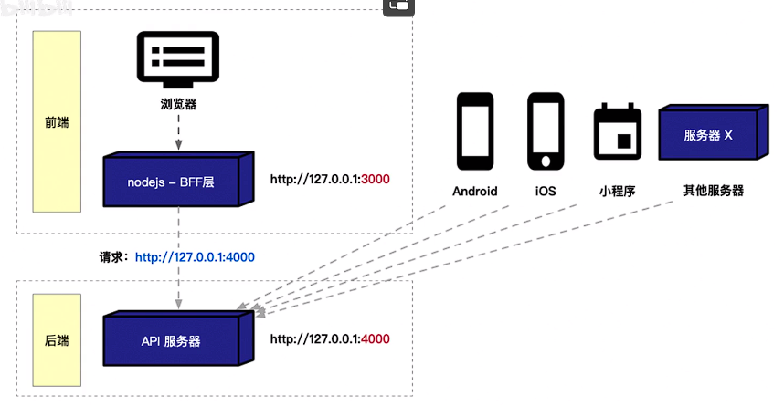

## 跨域问题解决

### 基础案例 - [示例代码](https://github.com/kang-git/crossOrigin)

>   web服务和api服务均使用koa托管，示例代码具体文件结构如下
>
>   代码中使用不同分支区分初始表现及各解决方案
>
>   +   crossO   		初始表现
>   +   backResolve              后端配置响应头解决
>   +   feNginx    	      前端nginx反向代理
>   +   feBFF    		前端搭建BFF层

```shel
# frontend	
.
|-- demo.html
|-- node_modules
|-- package.json
|-- server.js
`-- yarn.lock

# api-server
.
|-- node_modules
|-- package.json
|-- server.js
`-- yarn.lock
```


### 解决方案1 - 后端配置响应头


>   前端代码不需要有任何改动，直接在后台api 过滤合理的请求源并 配置允许跨域的响应头即可

```js
// 后台解决跨域响应头配置
app.use(async (ctx, next) => {
    // 请求源白名单
    const allowedOrigins = ['http://127.0.0.1:3000']
    const requestOrigin = ctx.headers.origin
    if(allowedOrigins.includes(requestOrigin)) {
        ctx.set('Access-Control-Allow-Origin', requestOrigin)
        ctx.set('Access-Control-Allow-Methods', 'GET, POST, PUT, DELETE')
        ctx.set('Access-Control-Allow-Headers', 'Content-Type')
        ctx.set('Access-Control-Allow-Credentials', 'true')
    }
    await next()
})
```


### 解决方案2 - nginx反向代理


>   后台api服务代码不需要任何改动，前端架设nginx配置, nginx代理配置如下

```nginx
# nginx 代理配置
server {
    listen     5000;
    server_name 127.0.0.1;

    location / {
        proxy_pass http://127.0.0.1:3000;
    } 
    location /api {
        proxy_pass http://127.0.0.1:4000;
    } 
}
```

```js
// 前端页面接口调用
reqBtn.addEventListener('click', _ => {
    // nginx反向代理时需要访问nginx代理出来的web服务端口
    // 实际上web服务启动在 3000 端口
    // 实际上api服务启动在 4000 端口
    axios.post('http://127.0.0.1:5000/api/task').then(res => {
        console.log(res.data)
        const resBox = document.getElementById('resBox')
        resBox.innerText = JSON.stringify(res.data)
    }).catch((err) => {
        console.log(err);
    })
})
```

>   前台服务启动代码不需要改动，前台页面代码请求地址更改到nginx代理的5000端口下， 
>
>   此时前端服务位于 127.0.0.1:5000
>
>   前端访问后端接口时访问的是 127.0.0.1:5000/api
>
>   两者处于同一个域下，规避了浏览器跨域限制


### 解决方案3 - 搭建BFF层



>   搭建bff层的本质逻辑是让web服务充当了中间代理人，所有请求后端的接口先走同域的web 3000 端口，然后web服务去请求后端4000接口，由于web服务到后端接口直接是服务端到服务端，不受浏览器跨域限制

```js
// 前端页面发起请求更改
// 搭建bff层时请求端口直接该为前端自身web服务的端口
axios.post('http://127.0.0.1:3000/api/task').then(res => {
    console.log(res.data)
    const resBox = document.getElementById('resBox')
    resBox.innerText = JSON.stringify(res.data)
}).catch((err) => {
    console.log(err);
})
```

```js
// 前端服务本身对后端接口做一层转义包装
router.post('/api/task', async (ctx, next) => {
    const res = await axios.post('http://127.0.0.1:4000/api/task')
    ctx.body = res.data;
})
// 前端服务代理去请求后端接口，拿到响应后前端服务将响应返回浏览器
```

>   方法1是 - 后端解决 - 前端代码不动 - 后端api接口配置响应头
>
>   方法2是 - nginx配置 - 后端代码不动 - 前端请求nginx代理服务
>
>   方法3是 - bff层 - 后端不动 - 前端请求和前端服务做对应修改


### More

>   当然其实还有jsonp这种古老的传说
>
>   另外，该笔记是学习B站【哲玄前端】视频随手记录，令人意外的是在抖音的评论区这个问题引发了激烈的争吵，一些人认为显示中的项目上线都是代码打包好交给后端或者运维去部署操作，跨域也一般是后台配置响应头，但是哲玄给出了需要思考的令一面，如果你在项目中需要访问一些第三方API时，如果前端不能解决这个问题就不用api了嘛，显然不能，
>
>   最后他贴了张图，给了我更多思考，后端需要花更多的精力保证接口服务的多平台适用及稳定性，而不应该单纯为了浏览器客户端的策略限制而去分散并无逻辑产出的编码精力


>   哲玄认为：红框产生的问题交给红框自己解决
>
>   :bulb:或许分久必合，全栈才是终结这个话题的必然道路？